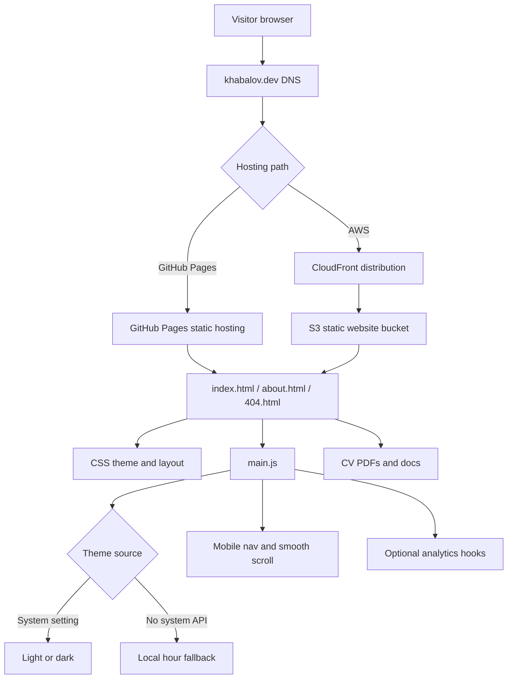

# Site Architecture

This static portfolio is designed for simple hosting on GitHub Pages or AWS S3 plus CloudFront. It has no server-side runtime; navigation, theme selection, and analytics hooks run in the browser.

## Request Flow

1. A visitor requests `https://khabalov.dev/`.
2. DNS points the domain to the hosting layer, either GitHub Pages or CloudFront.
3. The hosting layer returns static files from the repository or S3 bucket.
4. HTML loads shared CSS and `js/main.js`.
5. The browser applies the visitor theme:
   - system light/dark preference when `matchMedia` is available;
   - local time fallback when system preference APIs are unavailable.
6. Navigation links move within the same page or to `about.html`.
7. Missing pages should resolve to `404.html` through GitHub Pages automatically or through the S3/CloudFront custom error configuration.

## Deployment Flow

1. Changes are committed to `main`.
2. The GitHub Actions workflow validates HTML.
3. Static assets are synced to S3 with long cache headers.
4. HTML, `404.html`, and `robots.txt` are uploaded with short/no-cache headers.
5. CloudFront is invalidated so visitors see the current pages.

## File Map

- `index.html` - homepage, profile, projects, skills, contact, CV links.
- `about.html` - full project and writing/publication page.
- `404.html` - branded not-found page.
- `robots.txt` - crawler access rules.
- `css/styles.css` - base layout, theme variables, page components.
- `css/responsive.css` - responsive breakpoints and print styles.
- `js/main.js` - theme synchronization, mobile navigation, smooth scroll, tracking hooks.
- `docs/` - CV PDFs and supporting setup/architecture notes.
- `.github/workflows/deploy.yml` - AWS S3 and CloudFront deployment workflow.

## Mermaid Diagram

## Error Handling

- `404.html` is committed for GitHub Pages automatic 404 handling.
- For AWS, configure the S3 website error document and CloudFront custom error responses to `/404.html`.
- The deploy workflow uploads `404.html` with no-cache headers so error-page edits appear immediately after invalidation.
